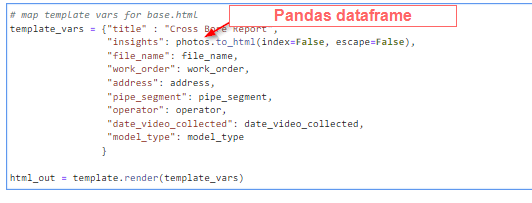
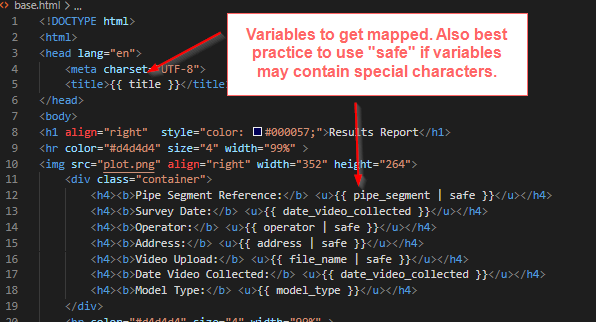
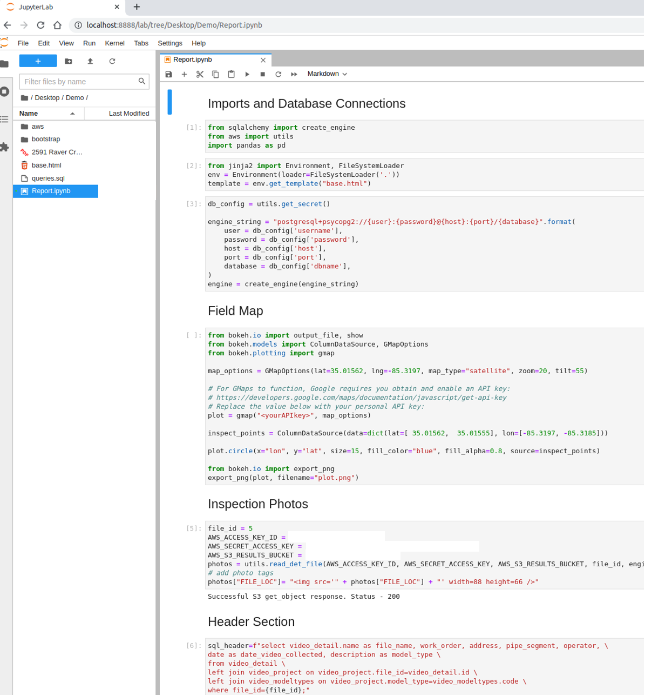
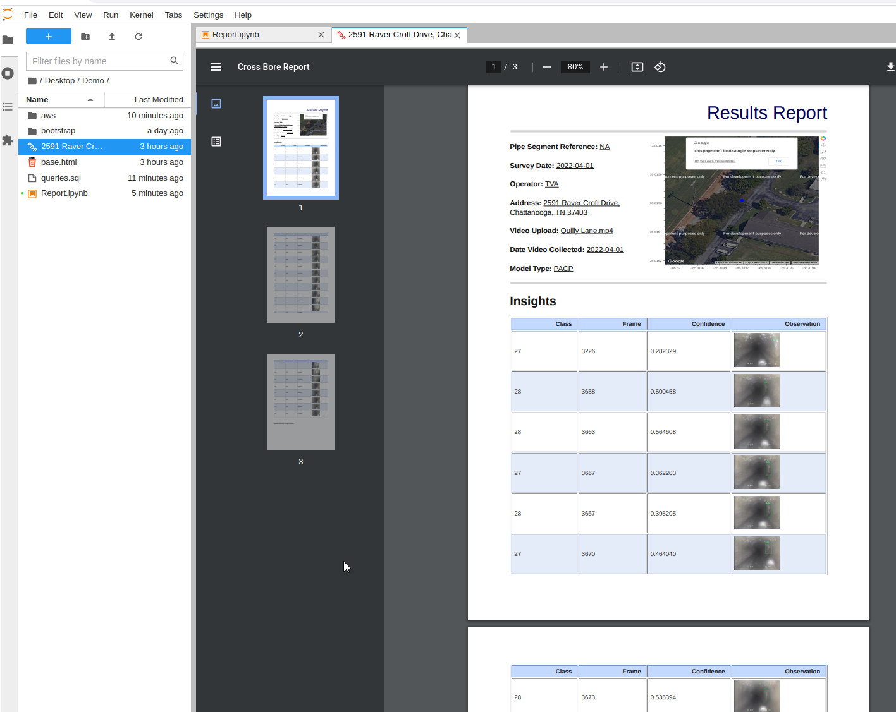

# Generate PDFs from Jinja Templates

Outline of the process of pulling data from multiple data sources and concolidating into configurable PDF exports. Similar tools are available in Django, but if you are generating a large amount of PDFs, it's a best practice to break it out as its own service, and let Django be responsible only for hosting your site or API. 

## Process Flow


Start by using Pandas to connect to the data sources, and converting the dataframes into html using the <i>to_html</i> method. 

Next create your Jinja base template <i>base.html</i>

Notes on Jinja:
```
variable string: {{ }}
comment: {# #}

For loop:
	<ul id="navigation">
	
		<li><a href="{{ item.href }}">{{ item.caption }}</a></li>
	
	</ul>

Access attributes of variable by either of two ways:
{{ foo.bar }}
or
{{ foo['bar'] }}

Filter are denoted by the pipe | character ex. {{ name|striptags|title }}

Manual Escaping for well formated HTML: {{ user.username|e }}

Manual Variable assignment: 

Using builtin Python methods on vars:  {{ page.title.capitalize() }},  {{ int(value) }}

```

To map your variables either set by queries or enviroment variables, use the <i>render</i> method.







You can also add in your own custom graphs for example from Plotly, or webmaps for example Leaflet or making an API call to and ESRI portal. 




And final PDF will look like as so, you can also import your own custom bootstrap css and javascript to achieve almost any customizable presentation. 




# **Installing Weasyprint on Windows

WeasyPrint converts HTML including images to PDF, it's cross platform but Windows requires a decent amount of massaging to persuade it to work. You'll need to install Pango and Cairo manually, and create the new env variables, due to this complexity it's easier to run on Linux, or from inside an Linux based container. 
